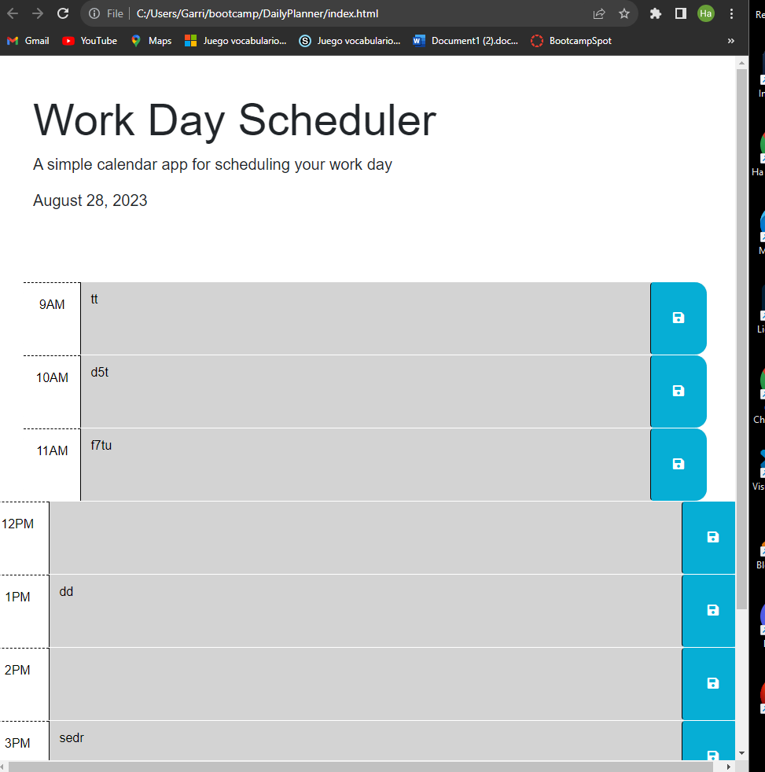

# DailyPlanner
This is a daily planner for a person who has the typical 9-5 schedule. It is used to help people who have a busy schedule ahead of them organize or plan out their day. Each time block allows you to enter and save events, and the app color-codes the time blocks to indicate whether they are in the past, present, or future.

## User Story 
AS AN employee with a busy schedule
I WANT to add important events to a daily planner
SO THAT I can manage my time effectively

## Resources 
https://www.w3schools.com/
https://stackoverflow.com/ 
https://developer.mozilla.org/en-US/
All links provided were used to assist me
A peer assisted me with the color coding if/else statement. 

## Picture

